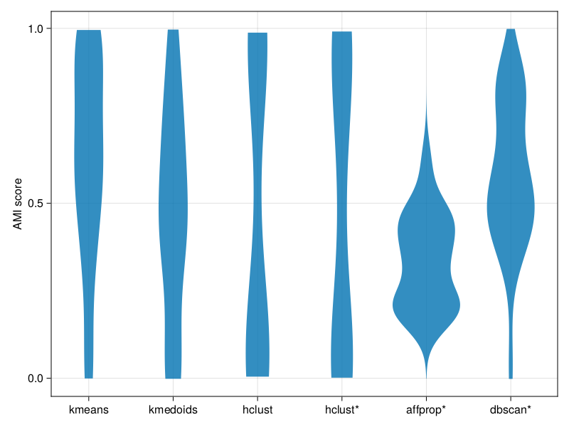

# ClusteringBenchmarks

[](https://github.com/HolyLab/ClusteringBenchmarks.jl/actions/workflows/CI.yml?query=branch%3Amain)
[](https://codecov.io/gh/HolyLab/ClusteringBenchmarks.jl)

This is a repository of data sets and metrics which may be used to evaluate clustering algorithms. The data sets include:

- [Marek Gagolewski's collection](https://clustering-benchmarks.gagolewski.com) (direct access to [data](https://github.com/gagolews/clustering-data-v1)). See `?load_gagolewski` for details about how to load the data sets. Quite a few of these are not very "naturalistic"; among the low-dimensional data sets, the "sipu" and "fcps" batteries arguably have a larger proportion of problems that one might imagine coming from real data.

The metrics to compare the agreement between two clusterings of the same data set include:
- [Adjusted Mutual Information (`ami`)](https://dl.acm.org/doi/abs/10.1145/1553374.1553511?casa_token=T02zuKJpK3AAAAAA:7caf54YsKdR0Xf4nTPnCrY0Na906rGbuNh-IPvem7cgCxSHqLobsbhYGJc4A90TqrDYqNvQShj7vvA)
- [Normalised Clustering Accuracy (`nca`)](https://arxiv.org/pdf/2209.02935.pdf)

Both support only hard clustering; at present there is no metric for soft clusterings. `ami` is recommended because
it does not require that both clusterings have the same number of clusters, and it scales reasonably well when there are many clusters.

[Clustering.jl](https://github.com/JuliaStats/Clustering.jl) contains additional evaluation metrics. Its `mutualinfo(x, y; normed=true)` is closest to this package's `ami`; see the AMI paper for details on the differences.

## Benchmarking Clustering.jl

`ami` scores were computed for several algorithms in Clustering.jl on a subset of the Gagolewski collection (see `demos/bench_clustering.jl` for details). The results are shown as a violin plot below:



Higher AMI score is better.

Some algorithms depend on computing the pairwise distance matrix, and thus scale poorly for large data sets.
For these algorithms, any data set with more than 3000 points was excluded. Here were the number of benchmarks that were runnable for each algorithm:

```
5×2 DataFrame
 Row │ Algorithm  Count
     │ Any        Int64
─────┼──────────────────
   1 │ kmeans        45
   2 │ kmedoids      27
   3 │ hclust        27
   4 │ affprop       27
   5 │ dbscan        26
```
